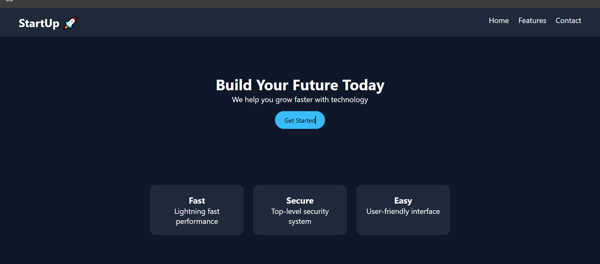

# 🚀 Startup Landing Page - Day 1 Project 16

## 📌 Project Overview

This project is a modern **Startup Landing Page** created as part of my semester challenge to build 200 websites.

It represents a product/company homepage with a hero section, features, and call-to-action.

---

## 🎯 Features

* 🌐 Navigation Bar
* 🚀 Hero Section with Call-to-Action
* ⚡ Features Section (Fast, Secure, Easy)
* 🎨 Clean and Modern UI
* 📱 Responsive Layout

---

## 🛠️ Technologies Used

* HTML5
* CSS3 (Flexbox)

---

## 📂 Project Structure

```id="m5k2z1"
site-16-landing-page/
│
├── index.html
├── style.css
├── preview.png
└── README.md
```

---

## 📸 Preview

> ⚠️ Make sure `preview.png` is uploaded in the same folder



---

## 💡 Learning Outcome

* Learned landing page design
* Practiced multi-section layout
* Built modern UI components
* Improved UI/UX skills
* Strengthened Git & GitHub workflow

---

## 🔥 Author

**Yash Patil**
Future Data Engineer 🚀

---

## ⭐ Note

This project is part of my goal to build **200 websites** to improve my web development and design skills.
